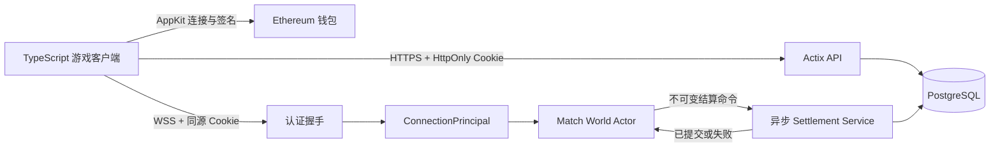
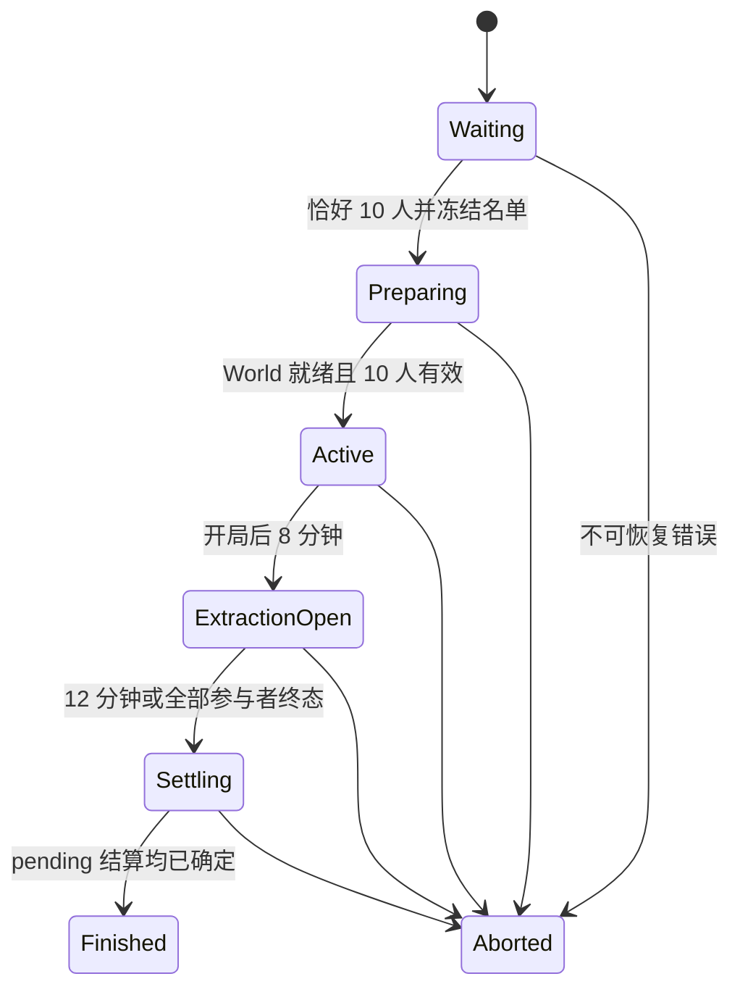

# 体素撤离 PVP MVP 技术设计

## 设计目标

在保留 Voxelize 通用引擎边界的前提下，实现一个服务端权威、可验证且不会复制永久资产的 10 人撤离 PVP。完整证据见：

- `research/repository-integration.md`
- `research/auth-persistence.md`
- `research/gameplay-runtime.md`

设计不追求跨进程共享 World、进行中比赛崩溃恢复、链上资产或完整运营后台。MVP 优先保证信任边界、局内资产守恒、撤离结算幂等和可重复自动化测试。

## 应用与引擎边界

```text
apps/
  extraction-server/   # Rust/Actix 游戏应用，独立 Cargo manifest
    src/{auth,http,persistence,match_runtime,gameplay,ops}/
    migrations/
  extraction-client/   # Vite + TypeScript + Three.js + Reown AppKit
    src/{auth,network,state,game,hud,lobby,results,warehouse}/
  extraction-e2e/      # 协议客户端、Playwright、多客户端场景
```

`extraction-server` 通过 path 依赖根 `voxelize` crate。SQLx、SIWE 和业务依赖不进入根引擎包；客户端加入 `apps/*` pnpm workspace，不继续扩展现有超大 Demo `main.ts`。

Voxelize 核心只增加通用能力：

1. 可插拔 HTTP routes 与异步 WebSocket `ConnectionAuthenticator`；
2. 返回 `Result` 的原子 World Join；
3. 网络 detach、同 principal rebind、最终 despawn；
4. 动态 World prepare/preload/stop/remove；
5. opt-in strict request/movement policy；
6. 非法枚举、畸形 JSON、handler 大小写和数组越界的防 panic 修复。

strict policy 仅由 PVP World 显式启用。现有 Demo 可保留 legacy 行为；无条件安全修复不允许随玩法回滚撤销。

## 总体数据流



World tick 不执行 SQL、不 `.await`、不 `block_on`。所有数据库工作通过有界命令/结果通道进入异步服务；队列满时失败关闭，不丢弃资产命令。

## 身份与认证

### 标识分层

- `connection_id`：每次 WebSocket 随机生成，只用于连接路由；
- `session_id`：认证会话内部 ID，不广播；
- `account_id`：永久 UUID，仓库、匹配和重连主键，不广播给其他玩家；
- `public_player_id`：每局随机 UUID，可在该比赛内公开；
- Ethereum address：经 SIWE 验证的钱包凭证，不作为局内公开 ID。

public 模式忽略查询参数 `client_id`、钱包地址和客户端用户名。MVP 禁用 WebRTC，避免第二套未绑定 principal 的身份通道。

### Reown/SIWE

客户端使用纯 TypeScript 适配的 Reown Ethers v6 adapter：`@reown/appkit`、`@reown/appkit-adapter-ethers`、`@reown/appkit-siwe`、`ethers`、`siwe`；固定 `networks/chains = [mainnet/1]`，关闭 email/social 登录和 analytics。

服务端使用当前兼容工具链的 SQLx 0.8.x 和 `signinwithethereum 0.8.x`。后者启用 `alloy` 以支持 EIP-1271/EIP-6492；实施第一阶段必须先做最小编译和 EOA/智能钱包验证，失败时暂停选型，不回退到停止维护的 `siwe 0.6`。

```text
GET  /api/auth/siwe/nonce
POST /api/auth/siwe/verify
GET  /api/auth/session
POST /api/auth/logout
GET  /api/warehouse
POST /api/matchmaking/queue
DELETE /api/matchmaking/queue
GET  /api/matches/{match_id}/result
GET  /api/matches/latest-result
```

nonce 使用 CSPRNG、5 分钟 TTL、只存 SHA-256，并在事务中条件消费。服务端精确验证 version、domain、URI、chain ID 1、nonce、issued-at、not-before、expiration 和签名。domain/URI 来自配置 allowlist，不信任任意 Host 转发头。

会话使用 32-byte 随机不透明 token；生产 Cookie 为 `Secure + HttpOnly + SameSite=Lax + Path=/`，数据库只存 SHA-256。默认绝对 TTL 7 天、idle TTL 24 小时，均可配置。WebSocket 自动携带同源 Cookie；长期 token 不进入 URL 或 localStorage。

EOA 本地验签；智能钱包 RPC 设置短超时、并发上限并失败关闭。RPC 故障只阻止需要 RPC 的新登录，不影响已有会话、实时比赛或链下结算。地址/网络切换或钱包断开时官方客户端调用 logout，服务端收到后撤销 session 并关闭其 WebSocket。未上报的本地钱包 UI 状态对服务端不可观测；服务端只以会话撤销和绝对/空闲过期为安全边界。

## 匹配、World 与重连

匹配使用单进程 FIFO solo queue，并以 `account_id` 保证一个账号最多拥有一个非终态参赛席位；`Dead/Extracted/TimedOut` 后释放该互斥，允许按产品规则重新排队。达到恰好 10 个已认证且仍连接的账号后原子冻结 roster；9 人不启动，第 11 人和开局后的迟到加入均拒绝。



参与者子状态为 `Active | Disconnected | SettlementPending | Dead | Extracted | TimedOut`，终态单向幂等。比赛使用可注入单调时钟和绝对 deadline，数据库记录对应 UTC 时间点。

Preparing 尚未进入 Active 时若任一 roster 连接失效，则把该未开局比赛标记 Aborted、清理部分创建的 World，并按原 `enqueued_at` 恢复其余在线玩家；此路径不创建比赛成绩、背包或资产流水，也不适用 60 秒重连。

每局创建 `saving(false)` 的独立 World。底层 chunk 使用 `[-10,-10]..[9,9]` 提供 `320 x 320` 空间，玩法精确限制 `x,z in [-150,150)`。seed、generation/gameplay/config version 写入比赛记录；生成器只读取这些输入。10 个出生点从版本化候选中按 seed 稳定分配并保持安全间距。

Active 后断线只 detach 网络，角色、生命、位置和背包留场且可被攻击；角色不能主动操作。同 `account_id` 在 60 秒内可 rebind 原实体，超时只触发一次死亡。Waiting 断线直接离队。Finished/Aborted 后停止写入、迁出连接并幂等移除 World、Actor 与 pending tick。

## 玩法领域模型

核心组件：`MatchPlayerComp`、`HealthComp`、`CombatComp`、`MiningComp`、`ResourceInventoryComp`、`RoundStatsComp`、`LootDropComp`。核心资源：版本化 `GameplayConfig`、可替换 `MatchClock`、有界 intent 队列、`HarvestedVoxelSet`、`PendingDropQueue`、`SpawnedDropIds` 和 settlement 通道。

`GameplayConfig` 是战斗、挖掘、拾取半径、出生点、撤离区、生成和统计价值的唯一来源。首版统计权重固定为 `dirt=1, gold=10, diamond=100`，仅用于只读分数且不代表兑换价值；调整必须增加 config version，历史 settlement 始终按其比赛绑定的版本计算，不追溯重估。

### 版本化意图

```text
pvp:v1:attack      { sequence, weaponSlot }
pvp:v1:mining      { sequence, action: start|maintain|cancel, voxel? }
pvp:v1:drop-slot   { sequence, slot, expectedInventoryRevision }
pvp:v1:get-state   {}
```

客户端不提交 account、target、damage、完成时间、资源类型或数量。Rust serde DTO 与 TypeScript runtime decoder 各有唯一入口，并共享契约 fixture。自身生命、背包、挖掘和结算状态通过 Direct 消息同步；每类状态带 revision，旧 revision 被忽略，重连获取全量快照。未知入站 Event 在 strict World 失败关闭。

### ECS 顺序

`set_dispatcher` 会整体替换默认链，应用必须复制全部核心系统并插入：

```text
UpdateStats -> CurrentChunk
-> MiningResolution -> ChunkUpdating -> ChunkRequests/Generating/Sending/Saving
-> Physics -> MovementValidation
-> CombatResolution -> DeathResolution -> ManualDropResolution
-> DropSpawn -> AutoPickup
-> ExtractionResolution -> MatchTransition
-> GameplayPrivateSync / GameplayPublicMeta
-> EntitiesSending / PeersSending -> Broadcast -> Cleanup -> Events
```

每次升级 Voxelize 都要与默认 dispatcher 做结构比较测试。同 tick 采用死亡优先于拾取和撤离完成，避免死亡玩家同时捡物或撤离。

### 挖掘

按住操作由 start/maintain/cancel 表示，服务端持续验证状态、阶段、工具、300 边界、距离、视线和目标方块。达到泥土/黄金/钻石 `0.5/1.5/3` 秒后，先用 `HarvestedVoxelSet` 原子 claim 坐标，再写 AIR 更新并固定产生 1 个资源。

claim 必不可少：`Chunks::update_voxel` 只进入 staging，同 tick 读取仍可能看到旧方块。背包装不下的 remainder 转入 `PendingDropQueue`。任何取消条件清零进度；客户端 raw UPDATE 在 strict World 禁用。

### 战斗与生命

攻击意图校验 sequence、Alive、比赛阶段和固定武器；合法挥击无论命中或落空都消费 0.6 秒冷却。服务端从权威位置/方向构造眼睛射线，遍历最多 9 个存活玩家 AABB，选择 3 格内最近目标并用体素 trace 检查完整方块遮挡。

生命为 `0..=20` 个半心单位，命中减 2，无恢复。归零使用 `Alive -> Dead` CAS，只进入一次死亡流程。MVP 不增加护甲、暴击、击退、环境伤害或延迟补偿。

### 背包、掉落与拾取

12 格背包组件字段私有；insert 固定执行“同类未满 64 的堆叠优先、空格其次”，返回 accepted/remainder，并增加 revision。固定装备属于独立配置。

局内资产任一时刻只属于：`玩家背包 | PendingDropQueue | 世界 LootDropComp`。死亡和整组丢弃先把资源原子移动到确定性 pending drop，再清槽；队列本身是资产保管方，实体创建延迟不会丢失。DropSpawn 使用 drop ID 幂等创建，并按空间桶合并无保护的兼容掉落，避免满包挖泥土产生海量实体，但绝不按 TTL 删除资源。

自动拾取使用服务端距离并按距离、稳定 seat ID 排序；一个临界区内同时增加背包和减少掉落，剩余为零才删实体。手动掉落只排除丢弃者 2 秒。守恒测试始终计算 `背包 + pending + 世界掉落`。

## 撤离与永久结算

第 8 分钟从版本化有效候选中按 seed 选择并公开唯一撤离区。服务端按权威位置累计连续 8 秒；离区、死亡或断线中断。资格判定时间 `qualified_at <= hard_deadline` 才能进入 `SettlementPending`，第 12 分钟拒绝尚未完成者并停止全部玩法交互。

达到条件后参与者进入 `SettlementPending`，背包与交互冻结，生成服务端权威规范快照：

```text
idempotency_key = extract:v1:{match_id}:{account_id}
inventory_digest = SHA256(canonical_inventory_json)
```

异步事务执行：

1. 以 `(match_id,account_id)` 查找已有 settlement；相同 digest 返回原结果，不同 digest 报警并拒绝；
2. `FOR UPDATE` 锁定仍可结算的 participant；
3. 插入 settlement/items；
4. 按稳定 item_key 原子 upsert warehouse balance，并插入唯一 append-only ledger；
5. 把 participant 标记 Extracted；
6. commit 后才向 World 返回成功。

`SettlementPending` 的资格不因事务在第 12 分钟后提交而失效。首版 `settlement_grace=30s`，写入或同幂等键重试只能在 `hard_deadline + 30s` 前启动；之后仅允许读核对，不得创建新 settlement。未知 commit 结果持续查询唯一 settlement，不能猜测或重新发放；已提交结果保留，确认未提交且没有未决写入时转异常失败。

第 12 分钟后立即停止并清理玩法 World，结算 worker 与玩家结果 API 独立完成核对。宽限期后数据库仍不可达时返回 `PendingReconciliation`，数据库恢复后以 settlement 是否存在收敛为 `Extracted|Aborted`。进程在 commit 前崩溃仍按规则作废，commit 后通知丢失则通过唯一键恢复成功。

## PostgreSQL 模型

最小表：

- `accounts`、`wallet_credentials`；
- `auth_nonces`、`auth_sessions`；
- `matches`、`match_participants`；
- `extraction_settlements`、`settlement_items`；
- `warehouse_balances`、append-only `asset_ledger`。

`extraction_settlements` 必须保存 32-byte `inventory_digest`、比赛 `config_version` 和 `total_value`；同一 `(match_id,account_id)` 重试时 digest 相同返回原结果，不同则报警并拒绝。关键唯一约束：`(chain_id,address)`、session/nonce hash、`(match_id,seat_id)`、`(match_id,account_id)`、`(settlement_id,item_key)`、`(account_id,item_key)`。数量非负且做 i64 溢出检查；地址保存 20-byte 规范值；永久资产保存稳定 `dirt/gold/diamond` 键，不保存运行时注册顺序 ID。

统计从 settlement/ledger 聚合，避免第二套可漂移真相。局内背包、生命、掉落和地形不持续写库，进程崩溃时未提交部分按产品规则作废。

## 客户端结构

单一 reducer 拥有 `Unauthenticated -> Lobby -> Queueing -> Loading -> InMatch -> DeathResult|ExtractionResult|PendingResult|AbortedResult -> Lobby`。所有原始 payload 在 network 边界解码，组件不各自解析 JSON。

- 登录：AppKit 连接不等于登录，SIWE session 成功后才开放仓库和排队；
- HUD：10 个稳定心槽、12 个稳定资源槽、固定装备、阶段倒计时、挖掘与撤离进度；
- World：Three.js 全屏主体验，不把场景放入装饰卡片；
- 结果：死亡展示击杀者/存活/资源得失后离开原 World；撤离只在数据库 commit 后显示永久入账；登录或结果待定时通过玩家本人 result API 恢复 `PendingReconciliation|Extracted|Aborted`，不暴露其他玩家实时状态；
- 重连：显示 60 秒状态并获取全量 revision 快照；换钱包/网络立即清理控制状态；
- 测试 bridge 只存在于测试构建，生产不暴露 teleport/flying/资产 Method。

## 内部只读运维

不做可视化后台。内部 CLI 或独立内网 listener 使用只读数据库角色/只读 repository，只查询脱敏账号、比赛、participant、settlement、warehouse 和 ledger；强制分页、超时、访问日志，禁止任意 SQL、余额修改和 settlement 重放。运维入口可整体关闭而不影响游戏。

## 兼容、发布与回滚

- 数据库 migration 只做 additive/expand-contract；运行应用无 DDL 权限；对非一次性数据库执行 migration 前另行危险操作确认；
- 生产不自动执行破坏性 down migration，不删除已提交 settlement/ledger；
- 先部署核心 hardening 和应用骨架，再开放 SIWE，最后开启 matchmaking feature flag；认证失败不得回退 guest/shared-secret；
- 发布采用 match drain：停止新匹配，等待当前局结束，再切换版本；运行中的 World 不热迁移；
- 玩法故障关闭新匹配并回滚应用，保留核心安全修复、schema 和账本；
- schema/依赖锁变更单独审查，不顺带更新无关核心依赖。

## 验证策略

1. 纯领域：状态机、fake clock、背包、守恒、幂等 ID、ray-AABB；
2. 生成器：固定 seed fingerprint、热点、深度和稀有度；
3. ECS：系统顺序、同 tick 竞争、移动边界、死亡优先级；
4. Actor：9/10/11 人、原子 Join、detach/rebind、World create/remove；
5. PostgreSQL：nonce 并发消费、settlement 并发、故障注入与恢复；
6. 跨端契约：Rust serde 与 TypeScript decoder 读取同一 fixture；
7. 客户端：钱包/换链、revision、半心、阶段和结果 reducer；
8. E2E：每次变更使用 2 个 Playwright 浏览器加 8 个轻量协议客户端组成合法 10 人局；10 浏览器完整场景用于 nightly/发布门禁，容量竞态主要由轻量 Actor 客户端验证；
9. Playwright：桌面/移动截图、Three.js canvas 像素非空、HUD 不重叠、资源与角色资产正确加载。
