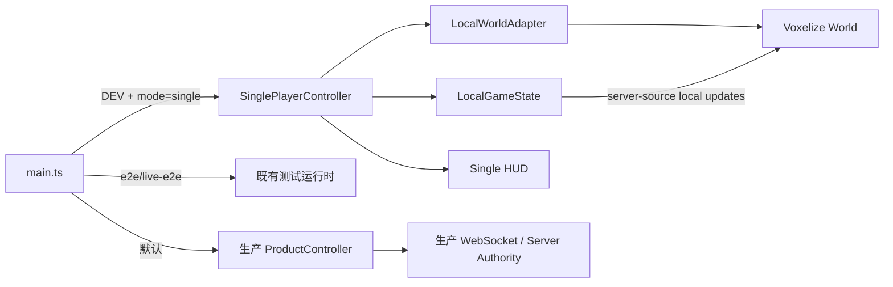

# Extraction 单机可玩垂直切片技术设计

## 设计目标

在不启动钱包、HTTP、WebSocket 或 Rust Server 的前提下，使用真实 Voxelize `World`、区块、mesher、物理、光照和第一人称控制完成一个开发环境专用的挖掘与撤离垂直切片。

界面与世界体验参考 Create Town Lab / Builder。按更新后的 PRD，贴图、手持物和 UI 像素资产**允许从参考实现搬运并本地化**，不必原创；生产多人模式、E2E bridge 和永久结算保持原有权威边界。

物理场景句：玩家在仍然明亮的傍晚走进一座废弃露天采石场；上层石台保留暖阳和清晰天空，越向下探索，石壁、矿层和空气逐渐转冷，薄荷绿色撤离信标始终指向回程。

颜色策略采用克制的完整场景调色：蓝色天空、暖橙地平线、暖灰石材、风化棕木、冷灰深层、金色矿脉、青蓝钻石和薄荷绿撤离信标。UI 只使用深色半透明底、暖白文字和一个状态色，不以玻璃面板或高饱和装饰抢占世界。

## 运行边界

- `main.ts` 保留现有模式优先级。只有 `import.meta.env.DEV && mode=single` 动态导入单机入口。
- E2E 与 live-E2E 继续使用各自测试运行时；单机不创建或暴露 `window.__VOXEL_EXTRACTION_E2E__`。
- 单机拥有独立 `LocalGameState`，不复用生产 `AppState` 的服务端 revision 或永久结算语义。
- 生产 `VoxelWorldSession` 不接受本地判定；可共享的只有相机、控制参数、纹理装载和无副作用工具。
- 生产构建由 Vite DEV 分支和产物扫描双重阻断单机运行时标记。

## 模块结构

建议新增 `apps/extraction-client/src/single/`，保持每个生产文件低于 300 行：

- `main.ts`：挂载单机 shell，创建和启动 controller。
- `controller.ts`：单机阶段、渲染循环、重开、错误和 dispose 编排。
- `runtime.ts`：World、renderer、camera、controls、interact 和 viewmodel 生命周期。
- `world-adapter.ts`：构造本地 INIT/LOAD，消费 World 请求包并应用本地 server-source 更新。
- `blocks.ts`：本地 block 定义、资源 ID、可挖属性和显示名称。
- `map.ts`：纯函数生成固定地图、出生点、撤离区和 Chunk 数据。
- `state.ts`：本地背包、挖掘、经过时间、提示、选择槽、撤离和结果 reducer。
- `input.ts`：指针锁、移动、按住挖掘、数字键、Q、H 和 Esc 接线。
- `loot.ts`：本地掉落实体、拾取距离、自身短暂排除和清理。
- `viewmodel.ts`：相机下的原创手臂/镐、行走摆动和挖掘挥动。
- `view.ts`：最小 DOM HUD 和结果渲染。
- `styles.css`：单机专用 UI，不修改生产面板的视觉层级。

实际实现可在不超过文件规模约束的前提下合并极小模块；不得把所有职责塞进一个单文件脚本。

## 本地 World 初始化

### INIT

`LocalWorldAdapter` 通过 `world.onMessage({ type: "INIT", json })` 提供完整初始化数据，再调用 `world.initialize()`：

- `chunkSize = 16`
- `maxHeight = 48`
- `subChunks = 3`
- `minChunk = [-2, -2]`
- `maxChunk = [1, 1]`
- `defaultRenderRadius` 覆盖完整 4×4 地图，但不请求边界外区块
- `clientOnlyMeshing = true`
- `textureUnitDimension = 8`
- 固定 `stats.time` 和 `doesTickTime = false`
- 重力、空气阻力和碰撞参数与生产玩家手感保持相近

本地 block registry 至少包含：Air、Quarry Stone、Pale Stone、Weathered Timber、Bedrock、Dirt、Gold、Diamond、Extraction Marker。资源继续使用生产 ID `1001/1002/1003`；环境方块使用单机专用固定 ID 且不进入背包。

### Chunks

- `map.ts` 使用固定种子生成 64×64×48 受控地图，覆盖 16 个 Chunk。
- 通过 `RawChunk` 写入 voxel 和初始 sunlight，再序列化为 ChunkProtocol，经 `world.onMessage({ type: "LOAD" })` 进入真实 ChunkPipeline。
- 地图纯函数返回出生点、撤离中心/半径和资源坐标摘要，测试不依赖 WebGL。
- 所有区块在开始计时前完成初始加载；加载中显示轻量状态。
- World 后续产生的 LOAD/UNLOAD packets 由 adapter 消费，不访问网络；边界内缺失 Chunk 可从确定性缓存响应。

### 方块更新

- 本地挖掘完成调用 `world.updateVoxel(vx, vy, vz, 0, { source: "server" })`。
- server source 仍进入 voxel、光照和 remesh 管线，但不会加入待发送网络 UPDATE。
- 每个资源坐标在本地规则中具有一次性 claimed 标记；World 当前 voxel 与 claimed 状态必须同时合法才可产出资源。
- 不可挖结构从不进入 mining state，也不调用 updateVoxel。

## 地图设计

首张地图固定为开放天空、垂直分层的废弃采石场遗迹：

- 上层：出生平台、薄荷绿撤离信标、断墙和可辨认回程轮廓。
- 中上层：宽阶、坡道、桥和泥土资源层，适合学习移动与挖掘。
- 中层：木梁支撑的切面与多个黄金矿脉，路线仍可从结构方块返回。
- 深层：冷灰石壁、少量青色环境光和钻石矿脉，视线更短但不做完全黑暗。
- 边界：Bedrock/不可破坏结构形成自然悬崖和围挡，避免透明墙感。
- 路线：不挖任何方块也能从出生点走到撤离区；挖掘资源不会破坏唯一回程路径。

地图不追求程序化无限世界。固定种子只用于稳定微变化和矿脉布局，核心轮廓由确定性规则手工塑形。

## 第一人称与移动

- 第一阶段的平台基线是带键盘和鼠标的 Chromium 桌面浏览器，横向视口不小于 1280×720；不设计触控输入、虚拟摇杆或竖屏布局。
- 使用 `PerspectiveCamera`，桌面初始 FOV 约 80°，以 Create Town 的宽阔近景感为视觉基准，通过浏览器并排检查微调。
- 眼高、体型、速度、重力和跳跃从生产 `VoxelWorldSession` 参数提取共享常量，避免单机与多人操作完全分裂。
- 使用 `RigidControls`、`Inputs` 和 `VoxelInteract`；禁止飞行、幽灵和方块放置。
- 指针锁后启用移动与挖掘；解锁、隐藏页面、结果或 dispose 时立即清空移动并取消挖掘。
- viewmodel 为相机子节点，不参与世界碰撞；包含低多边形/像素化手臂和镐，使用轻微步行动作与挖掘挥动。
- 动作只使用 transform，遵守减少动态效果设置；不使用 bounce 或大幅屏幕晃动。

## 挖掘、背包与掉落

- 可挖资源仅为泥土、黄金和钻石，基础时长沿用生产规则：0.5s、1.5s、3s。
- 每帧以 `VoxelInteract.target` 校验目标；松开左键、换目标、超距、解锁或进入结果均清零。
- 完成时先 claim 坐标，再修改 World，再写背包；任一步失败均不重复产出。
- 背包保持 12 格、同类优先、单格 64。状态逻辑使用纯函数并做资源守恒测试。
- 满包产出和 Q 整槽丢弃生成本地掉落实体；掉落使用 World block mesh 的 0.42 缩放视觉，轻微旋转。
- 掉落按固定半径自动拾取；手动丢弃者短暂排除，避免同帧立刻捡回。
- 结果只汇总当前背包内泥土、黄金和钻石数量，不计算价值、分数或永久入账。

## 撤离与结果

- 撤离区从开局起可见且可用，位于上层出生平台附近。
- 使用世界内薄荷绿环形/体素信标、柔和 emissive 和粒子或轻量动画表达，不依赖大型 HTML 面板。
- 玩家碰撞中心位于区域内时累计进度；连续 3 秒完成，离区立即归零。
- 完成是一次性阶段转换：停止 elapsed time、取消挖掘、停止移动、释放指针锁并冻结 World 交互。
- 结果层覆盖范围克制，显示“已撤离”、三种资源数量、本局用时、“本地单机，不保存”和“重新开始”。背景仍保留世界画面。
- 重开必须先完整 dispose 旧 controller/runtime，再用同一种子重建初始世界。

## 视觉资产与 UI

### 资产流程（允许搬运）

- **优先**：从 create.town/lab（或同源客户端资源）抽取方块贴图与可复用像素美术，落盘到 `apps/extraction-client/src/assets/single/`，经 `applyTextureGroups` / 本地 atlas 接入单机 World。
- **补充**：程序化 Canvas 纹理、imagegen 概念图，或其它来源素材，用于搬运未覆盖的方块（撤离信标、资源矿等）。
- 最终贴图以 PNG 或运行时 Texture 交付；`textureUnitDimension` 与 Lab 对齐为 16；最近邻采样、禁用 mipmap。
- 记录每个资产的来源（搬运来源 / 本地文件名）；运行时不得依赖 create.town 在线资源。
- 简单准星、进度线、槽位边框和撤离环优先使用 CSS/Canvas/Three 原生图形。

### HUD

- 不使用生产 `mountProductShell` 的完整顶栏和右侧面板；单机 shell 只有全屏 canvas、准星、顶部小标签、底部快捷栏、提示、撤离进度和结果层。
- 中央准星目标约 16px；顶部目标标签仅在有目标时显示。
- 底部快捷栏对齐 Lab ItemSlots 视觉（约 36×36 槽、#1a1a1a 底），保留 1 工具槽 + 12 资源槽的玩法需要。
- 无敌人时不显示生命条；无网络时不显示连接状态；经过时间以角落轻量文字显示。
- 字体首版可用系统等宽 fallback；若搬运参考字体，同样本地化到仓库。
- DOM 保留 aria-label、状态文本和键盘可见性；视觉上尽量像 canvas HUD，但不牺牲可访问性。

## 兼容与回滚

- 不修改服务端、数据库、协议和生产 Auth/Queue/Match 语义。
- 优先不修改 `packages/core`；若实现发现公开 API 无法完成本地 lifecycle，必须返回设计阶段并单独评审最小 Core 扩展。
- 单机入口保留 DEV 门；回滚可删除单机动态导入和 `src/single/`，不需要迁移或数据清理。
- 生产构建扫描新增单机唯一标记，确保 tree-shaking/DEV 分支没有泄漏正式入口。

## 验证策略

- 纯单元测试：地图确定性、可走路线摘要、背包堆叠/满包、资源守恒、挖掘状态、三秒撤离和 reducer 终态。
- 生命周期测试：初始化失败、重复重开、dispose、指针锁释放、事件监听和动画循环单实例。
- Core 集成测试：本地 INIT/LOAD、Chunk ready、server-source update、remesh 和无网络 packets。
- 浏览器检查：真实 Vite 单机入口、非空 WebGL、帧推进、移动/跳跃/挖掘/丢弃/拾取/撤离/重开。
- 视觉检查：至少覆盖 2560×1294、1440×900 和 1280×720 桌面视口；与 Create Town 并排检查镜头、世界占比、热栏、准星、纹理、天空、雾和手持物。移动端、触屏和竖屏不纳入本阶段检查。
- 生产回归：客户端 typecheck、Vitest、ESLint、production build、边界扫描和 `git diff --check`。

## 风险

- 本地 INIT block 结构不完整会让 mesher worker 初始化失败；先用最小 registry fixture 测试，再扩展材质。
- 初始 sunlight 或透明度错误会导致地图全黑/漏光；固定地图测试需检查代表坐标的 voxel 与 light。
- 64×64×48 全量加载和高分辨率 atlas 可能造成首屏卡顿；保持 8px texture unit、16 chunks 和有界 worker 数量。
- 手持 viewmodel 与世界 FOV/近裁剪面冲突时可能穿模；单独 camera layer 或深度策略需浏览器验证。
- 用户现有工作区有大量未提交修改；实现必须逐文件核对差异，禁止覆盖无关改动。
